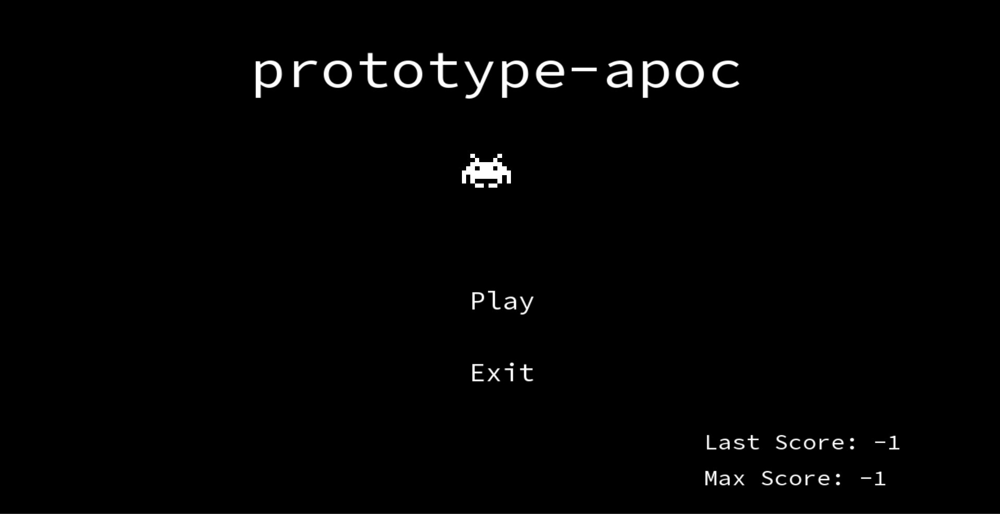
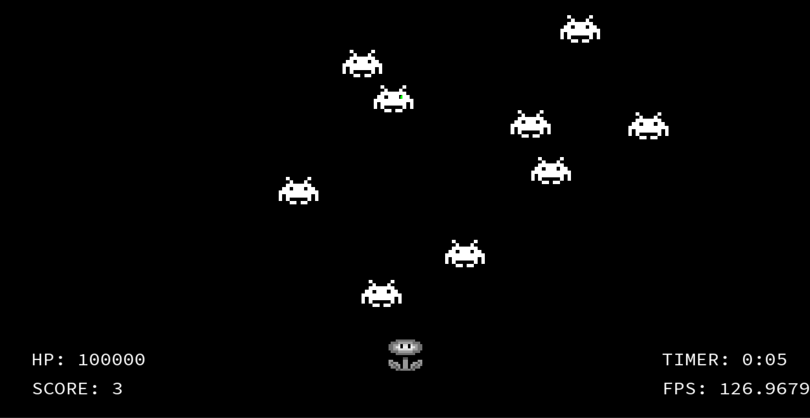

# prototype-apoc

# Intro
This game is called apoc and is about shooting monsters.

# Video
Check out a video of this game [here](https://www.youtube.com/watch?v=-u0zR0zuDQE) or refer below.

You may also find and download the video in ./videos.

# Screenshots
Check out some photos of this game below.





# Description
Apoc is a 2D-shooter where a player is a flower that must avoid being eaten by monsters. The flower can move and shoot the monsters in order to survive. The objective is to see how long the player (flower) can survive without being eaten by the monsters.

# Contents
This goes over the folders/files in the repository.

- assets: contains the font, sprite, sound, and music materials used

- packages: contains basic sfml build files

- screenshots: contains photos about this game

- src: files that build the game

- video: contains a video about this game

# Setup
We are assuming that the user knows some basic aspects of SFML and g++.

1.  You do not need to download SFML, since the files for SFML 2.6.1 are already included in the repository, so you only need to install, if not already, g++ version 13.1.0 either externally or through the SFML website. __Using outdated or newer SFML/compiler versions other than the one specified may cause errors.__ If you install the latest SFML version, then you have to install the corresponding latest g++ version explained on the SFML website and may have to replace some of the sfml/g++ files in the repository. It should also be noted due to such library linkage errors, libstdc++-6.dll is already included. This .dll file is located in your mingw32/bin folder and is different between g++ versions, since this one is built for x64 systems.

2.  Download the entire repository files.

3.  Open the repository in your local text editor or IDE. You may need to set the path of ```dir=packages``` so that your workspace automatically searches the subdirectories of that directory recursively. In VS Code, it can be manually set upon the "Quick Fixing" option.

4.  Switch into the ```dir=src``` and run ```make``` in your terminal of choice.

5.  Run the game using ```./apoc```.

# Controls
__Menu__

```W,S``` or ```Up, Down Arrows```: scrolls menu options

```Enter```: selects the menu option

<br>

__In-Game Controls__

```W,A,S,D``` or ```Up,Left,Right,Down Arrows```: movement for the flower.

```Mouse: Left Click```: flower shoots

```p```: to pause game, ```o```: to unpause game

```i```: to show crosshair, ```u```: to hide crosshair

```y```: to restart game, ```m```: to go back to the menu

```Enter```: to go back to the menu if game over

```esc``` or ```Click [x symbol] of program```: closes the program

# Limitations
These are some features that have not been implemented yet.

__Menu__

- Mouse hover/select menu options
- Title art/custom font
- Background image
- Stats tracked over sessions
- Settings tab: sound, difficulty, crosshair type/color, fps cap, resolution, or window size.
- Screenshot system

<br>

__In-Game__
- Background image
- Screenshot system
- Sprite animation
- Game over music should happen after player has ran out of health rather than pressing enter.
- One key toggle-binds, due to multi-input issues, toggle-binds uses two keys
- Enemy bots with health and/or ability to shoot.
- Special enemy bots, size of projectiles, size of enemy bots.
- Health regen system

# Bugs/Issues
- Pausing then unpausing may cause enemies to become invincible for a few seconds. It is best to avoid pausing overall during deeper progressions. [fixed?]

- There is bordered fullscreen support, but it may cause bullets to shoot in opposite directions.

- Too many enemies may cause collision inputs to be ignored. [fixed?]

# Settings
Until there is more options in the menu for a user to customize the game during runtime, the user must edit the code and recompile instead. Here are some notable variables to consider.

```crosshair.setFillColor(sf::Color::<color>);``` Replace crosshair \<color> of your choice with respect to the sf::Color class.

```player.health```: Set player health, make sure to update all instances while the constructor being optional.

```enemy_spawn_delay```: Base is 5 seconds with max of 1 second, modify for enemies to spawn more/less frequently, make sure to update all instances while the constructor being optional.

```enemy_perk```: used with spawn delay, kills threshold for level up enemy's spawn rate

```enemy_speed_modifier```: Base is a factor of 1 with max of 3, modify for enemies to move faster/slower, make sure to update all instances while the constructor being optional.

```enemy_perk_two```: used with speed modifier, kills threshold for level up enemy's speed

```{sound/music}.setVolume(<amount>)```: Replace \<amount> with an positive integer for sound effects and music, make sure to update all instances while the constructor being optional.

# Resources
These goes over the external assets and tools used.

__Tools__

- Written in c++ using VS Code

- g++ version 13.1.0 by WinLibs MSVCRT-Brecht Sanders

- SFML 2.6.1

- Saved through Git and hosted through GitHub

<br>

__Assets__

- [SFML Setup](https://www.sfml-dev.org/tutorials/2.6/)

- [Player: Fire Flower](https://www.pinterest.com/pin/pixel-fireflower-pin--469429961159390499/)

- [Enemy: Crab Space Invader](https://www.pngkey.com/maxpic/u2w7w7a9y3u2e6e6/)

- [Sound Effects](https://opengameart.org/content/retro-shooter-sound-effects)

- [Main Menu and In-Game Music](https://retro.sx/music/934)
